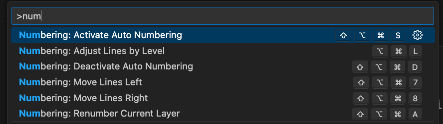

# Auto Numbering 

0.1.4.0.Tree level moving and numbering

Moving: move current same-level lines(and their childs) to Left or Right.
Numbering: add numbers by their tree level



Note:The HotKeys may not setup as shown. You can setup your HotKeys for convenient.

## Install

install indentation-based-numbering-0.1.4.vsix to your vs code to activate the extension.

(on the file click mouse right button and choose install)

## Moving Same-Level lines (When caret is at a block of text) 

####  1.Moves to the left.

####  2.Moves to the right.

## Numbering by tree-level

#### 1.Numbering Current Line (and all it's child line)
#### 2.Activate Auto Numbering 
#### 3.DeActivate Auto Numbering 
#### 4.Adjust beginning of each line by their tree level 

## Package Information

```json
{
  "name": "AutoNumbering",
  "version": "1.0.0",
  "description": "Auto numbering tool",
  "repository": {
    "type": "git",
    "url": "https://github.com/CricYoung/AutoNumbering.git"
  }
}
```

